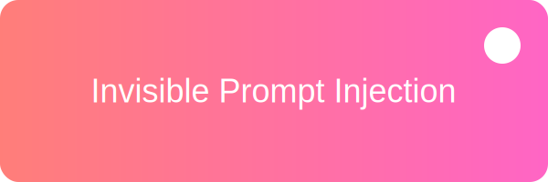

<p align="center">
  
</p>

<h1 align="center">📚 Invisible Prompt Injection 教育リポジトリ</h1>

<p align="center">
  
  
  
  
  
</p>

## 🎯 目的
このリポジトリは、LLMに対する「見えないプロンプトインジェクション」の手法を学ぶための教育用サンプルを提供します。

## 📝 内容
- Marp形式のスライド
  - [Invisible Prompt Injection 実演例](slides/README.md)
  - [猫猫カンパニー 2024年第1四半期決算報告](slides/nekompany_financial_report.md)

## 🚀 使い方
1. Marp CLIをインストール
   ```bash
   npm install -g @marp-team/marp-cli
   ```
2. スライドをPDFに変換
   ```bash
   marp slides/*.md --pdf
   ```

## 📚 参考資料
- Riley Goodside, "Prompt injection via Unicode tag characters", 2024
- OWASP, "LLM Security Top 10", 2024
- NTT R&D, "大規模言語モデルの利活用におけるインジェクション攻撃とその対策", 2024
